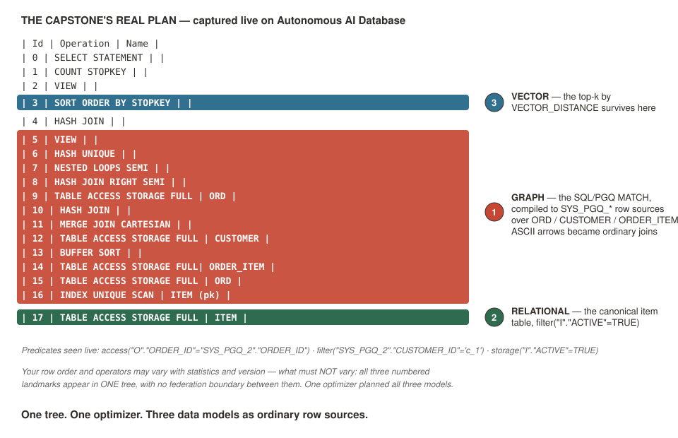

# Meaning, Not Keywords — and the One-Statement Finale

## Introduction

"Find me something like spicy vegetarian noodles" is a question about *meaning*, not keywords. In this lab you add AI Vector Search to the **same** `item` table you built in Lab 4 — with an ONNX embedding model that runs *inside* the database — and prove the claim vector-sync pipelines can't make: a brand-new item is findable by meaning **on the same commit**.

Then the finale: one SQL statement that walks the co-order graph from Lab 7, joins the relational truth from Lab 4, and ranks by vector distance — planned as **one tree by one optimizer**. That is the difference between a multi-model checkbox and a converged guarantee.

Estimated Lab Time: 9 minutes

### Objectives

* Add a `VECTOR` column and embed the menu in place with an in-database ONNX model
* Run semantic search filtered by a relational predicate in the same statement
* Prove same-commit freshness with an insert-then-search
* Run the graph + relational + vector capstone and read its single `EXPLAIN PLAN` tree

## Task 1: Embed the Menu in Place

1. In the **SQL worksheet** (also in `scripts/07_vector.sql`) — verify the model, add the column, embed:

    ```
    <copy>
    SELECT model_name FROM user_mining_models;

    ALTER TABLE item ADD (desc_vec VECTOR(384, FLOAT32));

    UPDATE item
    SET    desc_vec = VECTOR_EMBEDDING(menu_model
                        USING item_name || ' ' || description AS data);
    COMMIT;
    </copy>
    ```

    **What you should see:** `MENU_MODEL` (loaded in Lab 7), then the column added, then 6 rows updated. No embedding service, no API key, no copy pipeline — the vector is generated where the row already lives.

    > **If `MENU_MODEL` is missing:** go back to **Lab 7, Task 1** and run that block again — it is idempotent, so re-running is free. If the model still will not load (rare — it usually means object-storage egress is blocked on your tenancy), you can still finish the lab, and the detour is worth running anyway because it shows you exactly what the embedding buys. Also in `scripts/07_vector_fallback.sql`:
    >
    > ```
    > <copy>
    > SELECT item_name, price
    > FROM   item
    > WHERE  active
    > AND    (LOWER(item_name || ' ' || description) LIKE '%spicy%'
    >    AND  LOWER(item_name || ' ' || description) LIKE '%vegetarian%'
    >    AND  LOWER(item_name || ' ' || description) LIKE '%noodle%');
    >
    > SELECT item_name, price
    > FROM   item
    > WHERE  active
    > AND    (LOWER(item_name || ' ' || description) LIKE '%spicy%'
    >     OR  LOWER(item_name || ' ' || description) LIKE '%vegetarian%'
    >     OR  LOWER(item_name || ' ' || description) LIKE '%noodle%')
    > ORDER  BY item_name;
    > </copy>
    > ```
    >
    > The first query returns **nothing** — no menu item contains all three words. The second returns **noise**, in alphabetical order, because keyword matching has no notion of "closer". Nothing, or noise, with no way to rank by closeness: that gap is the entire reason AI Vector Search exists. Then ask a proctor to help get the model loaded so you can run the real thing.

## Task 2: Search by Meaning

1. Ask for something no menu item contains as keywords:

    ```
    <copy>
    SELECT item_name, price
    FROM   item
    WHERE  active
    ORDER  BY VECTOR_DISTANCE(desc_vec,
             VECTOR_EMBEDDING(menu_model USING 'spicy vegetarian noodles' AS data),
             COSINE)
    FETCH FIRST 5 ROWS ONLY;
    </copy>
    ```

    **What you should see:** **Szechuan Tofu Stir-Fry** at the top — zero shared keywords with your query — filtered by the relational `active` predicate in the same statement.

    **Why there is no index here, and when you would add one.** What you just ran is an *exact* search: the database compared your query vector against every row's vector and sorted by distance. On a seven-item menu that is the right answer and it is instant — an index would be pure overhead.

    Exact search costs one comparison per row, so at a million rows it stops being instant. The production move is an **approximate** search backed by a vector index. The usual choice is **HNSW** — *Hierarchical Navigable Small World* — which sounds worse than it is. Picture the vectors as cities and the index as a road network built in layers: a sparse top layer of motorways that lets a search jump across the map in a few hops, then progressively denser layers of local roads to home in. A lookup follows the motorways to roughly the right region, then walks the side streets to the nearest neighbours, touching a few hundred vectors instead of a million.

    The catch is in the word *approximate*: you trade a small, tunable chance of missing a true nearest neighbour for an enormous speed-up. You opt into that trade explicitly with `FETCH APPROX`:

    ```
    CREATE VECTOR INDEX item_desc_vec_ix ON item (desc_vec)
      ORGANIZATION INMEMORY NEIGHBOR GRAPH
      DISTANCE COSINE;

    -- ... then the same query, with APPROX added:
    ORDER BY VECTOR_DISTANCE(...) FETCH APPROX FIRST 5 ROWS ONLY;
    ```

    Don't run those here — at this scale the index would make the query slower, not faster. The point is that the *statement barely changes*: same table, same `WHERE`, same optimizer. Scaling this to a million menu items is an index decision, not a re-architecture.

## Task 3: The Freshness Proof — Insert, Then Search

1. This is the beat a bolt-on vector pipeline cannot replicate. Insert a brand-new item, embedding it **in the same transaction**, then immediately search:

    ```
    <copy>
    INSERT INTO item (item_id, category_id, item_name, description, price, active)
    VALUES (2003, 120, 'Vegan Dan Dan Noodles',
            'Hand-pulled noodles, spicy sesame-chili sauce, plant-based, no meat',
            1299, TRUE);

    UPDATE item
    SET    desc_vec = VECTOR_EMBEDDING(menu_model
                        USING item_name || ' ' || description AS data)
    WHERE  item_id = 2003;
    COMMIT;

    SELECT item_name, price
    FROM   item
    WHERE  active
    ORDER  BY VECTOR_DISTANCE(desc_vec,
             VECTOR_EMBEDDING(menu_model USING 'spicy vegetarian noodles' AS data),
             COSINE)
    FETCH FIRST 5 ROWS ONLY;
    </copy>
    ```

    **What you should see:** **Vegan Dan Dan Noodles** now in the results — in the live validation run it took the **#1 spot** (it is semantically closer to the probe than anything else on the menu) — committed and findable by meaning in the same breath. No sync window, no backfill job, no eventually-consistent index. Fresh on the commit.

## Task 4: The One-Statement Finale

1. The finale asks a question a real kiosk would ask: *given what this customer actually eats, and given a preference in plain English, what should we put in front of them?* Answering it needs all three models at once — and here is how the statement gets there, before you run it:

    * **The `ring` subquery is the graph step.** It walks `customer → placed → order → contains → item` for customer `c_1` and collects the distinct items they have actually ordered. That is their taste profile, derived from the order documents mongosh wrote — not a profile table somebody had to maintain.
    * **The join is the relational step.** Those item ids are just numbers; the canonical `item` table from Lab 4 supplies the trustworthy name, the current price, and the `active` flag. Corporate's truth, not a copy frozen inside an order.
    * **The `ORDER BY` is the vector step.** `VECTOR_DISTANCE` ranks what survived by how close each dish is *in meaning* to a preference string — `'vegan-friendly noodles'` — using the embedding the database generated in Task 1.

    Read top to bottom, it is: *narrow by behaviour, enrich by truth, rank by meaning.* On a polyglot stack those are three systems, two network hops, and a consistency argument about which copy is current. Here it is one statement, one transaction, one optimizer (also in `scripts/07_capstone.sql`):

    ```
    <copy>
    WITH ring AS (
      -- GRAPH: the items customer c_1 has actually ordered - their taste profile
      SELECT DISTINCT gt.item_id
      FROM GRAPH_TABLE (order_graph
        MATCH (c IS customer)-[IS placed]->(o IS ord)-[IS contains]->(i IS item)
        WHERE c.customer_id = 'c_1'
        COLUMNS (i.item_id AS item_id)) gt
    )
    SELECT i.item_name, i.price               -- RELATIONAL: canonical truth
    FROM   ring r
      JOIN item i ON i.item_id = r.item_id
    WHERE  i.active
    ORDER  BY VECTOR_DISTANCE(i.desc_vec,     -- VECTOR: ranked by meaning
             VECTOR_EMBEDDING(menu_model USING 'vegan-friendly noodles' AS data),
             COSINE)
    FETCH FIRST 5 ROWS ONLY;
    </copy>
    ```

    **What you should see:** three rows — customer `c_1` belongs to the noodle cohort you seeded in Lab 7, so their ring is **Szechuan Tofu Stir-Fry**, **Beef Chow Fun** and **Garden Salad** — with the **Szechuan Tofu Stir-Fry ranked first**. It is the only vegan dish of the three and the closest thing on their menu to noodles, and nothing in the query said either of those words. The recommendation is personal (it came from *this* customer's orders), current (it came from the canonical `item` table), and semantic (it was ranked by meaning) — in one statement.

2. Before you read your first plan, thirty seconds of anatomy:

    

3. Now look at how the engine ran it:

    ```
    <copy>
    EXPLAIN PLAN FOR
    WITH ring AS (
      SELECT DISTINCT gt.item_id
      FROM GRAPH_TABLE (order_graph
        MATCH (c IS customer)-[IS placed]->(o IS ord)-[IS contains]->(i IS item)
        WHERE c.customer_id = 'c_1'
        COLUMNS (i.item_id AS item_id)) gt
    )
    SELECT i.item_name, i.price
    FROM   ring r JOIN item i ON i.item_id = r.item_id
    WHERE  i.active
    ORDER  BY VECTOR_DISTANCE(i.desc_vec,
             VECTOR_EMBEDDING(menu_model USING 'vegan-friendly noodles' AS data),
             COSINE)
    FETCH FIRST 5 ROWS ONLY;

    SELECT * FROM dbms_xplan.display();
    </copy>
    ```

    **What you should see:** one plan tree. Use the annotated expected-plan figure to find three things in yours: **(1)** the scans of the graph tables (`ORDER_ITEM` / `ORD` — that's the GRAPH_TABLE match), **(2)** the access of the canonical `ITEM` table (RELATIONAL), **(3)** the `SORT ORDER BY STOPKEY` at the top — the vector top-k (VECTOR). Exact rows vary with statistics; the three elements in a single tree do not. Three models, row sources in **one tree**, planned by **one optimizer**, over data a Mongo driver wrote.

    

    One transaction boundary. One optimizer. One consistency model. One governance domain. Shared surfaces. You didn't hear the five guarantees — you ran them.

### Stretch (fast finishers): predict, then run

Change the probe to `'something light and healthy'` and predict the top result before you run it. Then try `'c_4'` instead of `'c_1'` in the `WHERE` clause — a burger-cohort customer — and watch the same statement return a completely different ring. Same query, different person, different answer: that is what "personalized" actually means when the profile is derived rather than maintained.

## Learn More

* [AI Vector Search users guide](https://docs.oracle.com/en/database/oracle/oracle-database/23/vecse/)
* [Converged database vs multi-model database — what's the difference?](https://blogs.oracle.com/developers/converged-database-vs-multi-model-database-whats-the-difference)

## Acknowledgements
* **Author** - Rick Houlihan, Field CTO, Oracle Data & AI Platform
* **Last Updated By/Date** - Rick Houlihan, July 2026
